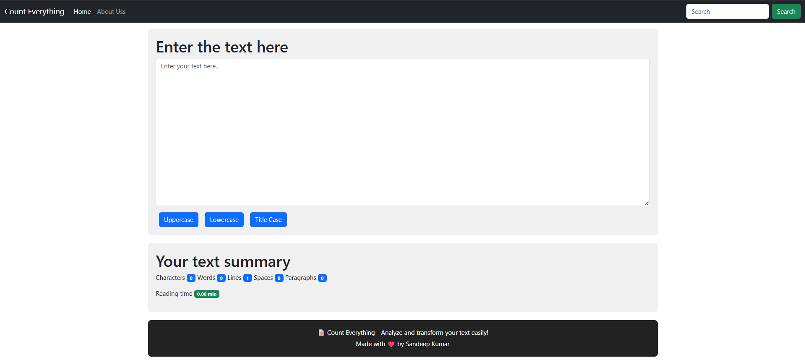

# COUNT-EVERYTHING


---

**COUNT-EVERYTHING** is a React-based web application that lets you **analyze and transform text**.  
It provides text case conversion, word/character count, paragraph analysis, and estimated reading time.

---

## 🌐 Live Demo

Click below to access the live app:  

[](https://SANDEEPKT13.github.io/COUNT-EVERYTHING)

---

## 🖼 Screenshot

  
> Replace `screenshot.png` with your actual app screenshot placed in the repo root.

---

## 🛠 Features

- Convert text to **Uppercase**, **Lowercase**, or **Title Case**  
- View **text summary**: characters, words, lines, spaces, paragraphs  
- Estimate **reading time**  
- Responsive and clean UI  
- Footer shows **app purpose** and **author**  

---

## 💻 Technologies Used

- **React**  
- **JavaScript / JSX**  
- **HTML5 & CSS3**  
- **Bootstrap 5**  
- **gh-pages** (for deployment)

---

## 🚀 Deployment

Deployed on **GitHub Pages** using the `gh-pages` branch.  

To deploy or update:

```bash
npm install
npm run build
npm run deploy
